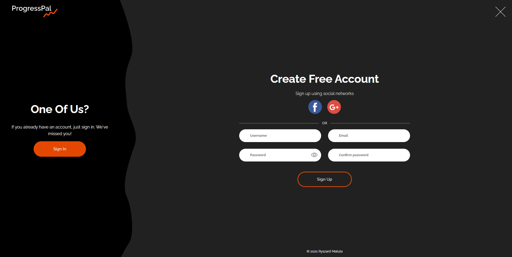
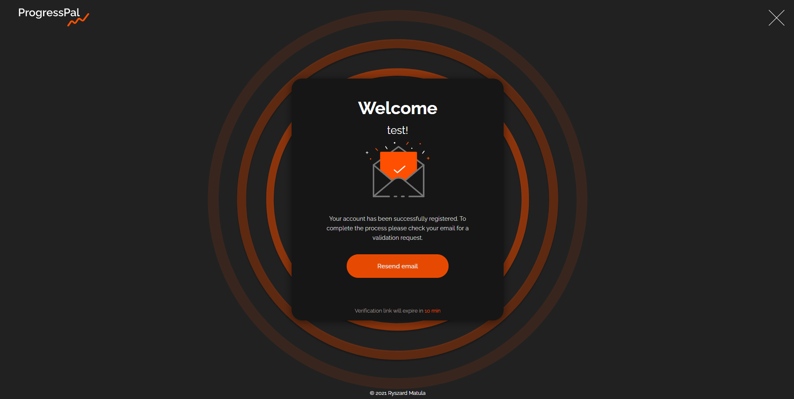

# ProgressPal

# Disclaimer

App is not ready yet

## Description

- [Technology Stack](#Frontend)
- [ERD Diagram](#ERD)
- [Screenshots](#Screenshots)
- [Features](#Features)

## Frontend

- React
- Typescript
- React Router Dom
- Apollo Client
- Formik
- Yup
- Framer Motion
- TypeScript
- GraphQL
- Styled Components

## Backend

- Typescript
- Node
- Express
- PostgreSQL
- TypeORM
- Redis
- Apollo Server
- GraphQL
- Nodemailer

## Features

- Sign in/Sign up
- Sign in/Sign up in with Google
- Sign in/Sign up in with Facebook
- Account Validation if user was registered without Google Button or Facebook Button
- Sending email after successful sign up
- Sending email inorder to recover the password
- Password recovery

# Every Page is Fully Responsive

## ERD

## Screenshots

### Sign in:

### Forgot Password:

### Sign Up:

### Greetings email:

### Registration Email:

### Reset Password:

### Verifiction Page:

